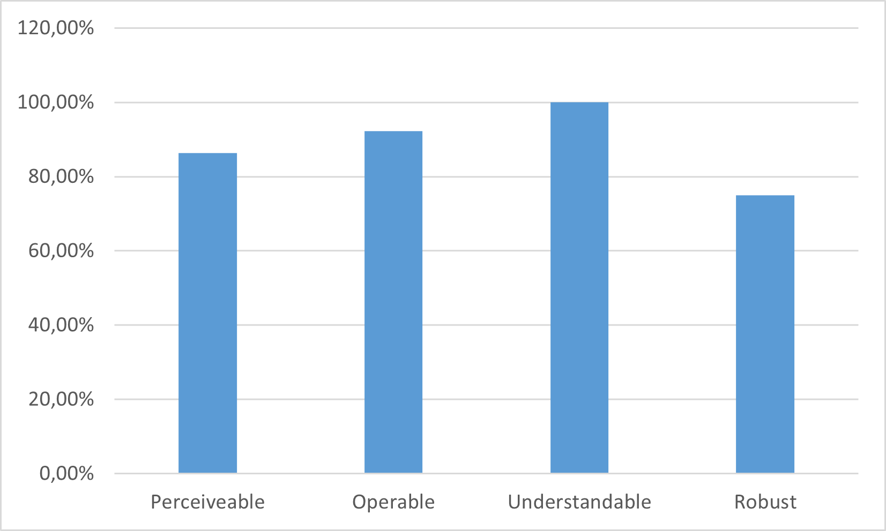

# moodle-local_oer

The Open Educational Resources (OER) plugin provides a graphical user interface (GUI) to release files from courses for public use.
The first version of the plugin was developed during a project about [open education](https://www.openeducation.at/). It was developed very close to the Graz University of
Technology customizations of Moodle. The use for other educational institutions was therefore very limited.

In this repository a refactored version of the plugin can be found. This version has been developed for Moodles Boost theme. Adaptations, which are necessary for the Moodle
instance at Graz University of Technology, were moved to subplugins. ~~The base plugin is fully functional without these subplugins.~~
Since the version v2.3.0 subplugins for loading the OER resources are necessary, but the basic versions for Moodle files are bundled with the local_oer plugin.

# Requirements

- Supported Moodle Version: 4.1 - 4.5
- Supported PHP Version:    7.4 - 8.3
- Supported Databases:      MariaDB, PostgreSQL
- Supported Moodle Themes:  Boost

This plugin has only been tested under the above system requirements against the specified versions.
However, it may work under other system requirements and versions as well.


# Setup

After installation of the plugin, there are several settings that can be made:

* `local_oer | metadataaggregator` if a subplugin is for linked external course metadata is installed, select the subplugin that should be used. (Default: Default courseinfo
  aggregator)
* `local_oer | requiredfields` Select the fields that will show as required in the file metadata form. `Title`, `License` and `Persons` are always required. (New setting since
  2.1.12)
* `local_oer | uselicensereplacement` When enabled, an additional textarea will appear below. (Default: No)
* `local_oer | licensereplacement` Enter replacements for the moodle license shortnames in the format: `cc-nd=>CC BY-ND 3.0`. The exchange takes place when the metadata is queried.
* `local_oer | zipperfilesize` Size of the ZIP files. The Zipper is a helper that can be used by upload subplugins to create ZIP Packages from released files in courses. For
  administrators there is a Download ZIP button in the OER view in courses, but this always generates only one ZIP of full size and ignores this setting.
* `local_oer | allowedlist` The capabilities to use the oer plugin are set for the editingteacher role by default. An allowance list is used to allow instructors to share files for
  OER. If all editingteachers should get access to it. This setting can be turned off, and the list then is used as disallowance list.
* `local_oer | notallowedtext` The text that is shown to editingteachers when they are not allowed to use the plugin.
* `local_oer | pullservice` When enabled, the Metadata and URLs to the released files can be directly accessed in Moodle (Default: No). The released metadata can be accessed
  through `https://*yourmoodledomain*/local/oer/public_metadata.php`.
* `local_oer | next_upload_window` This Button opens a configuration formular to configure the release cycle.
* `local_oer | releaseplugin` Select the upload plugin that will be used to upload released files to a repository.
* List of installed subplugins. Enable or disable them. If a subplugin has settings, a settings link will be shown.

### New settings in version v2.1.14

* `local_oer | coursecustomfields` Add course customfields to the resulting coursemetadata
* `local_oer | coursecustomfieldvisibility` The customfields have some visibility settings. The fields will be added to the course metadata respecting the visibility setting of the
  fields. Choose the level of visibility that will be added to the metadata.
* `local_oer | coursecustomfieldsignored` Select customfields to ignore them. The selected fields will not be added to the course metadata.
* `local_oer | coursetofile` When enabled, the course metadata can be selected for each file separately. The setting on course level will be applied per default, but can be
  overwritten per file. Also it is possible to add course metadata of other courses to a file, if the file is used in multiple courses.

### New settings in version v2.3.0

* `local_oer | applicationprofile` Select the default applicationprofile for the JSON metadata from pull service.

# Release snapshots

The metadata of released files is stored in an extra snapshot table. A snapshot contains all metadata the file had on the release. When the metadata changes a new release will be
created. Old releases remain in the table and can be seen as release history on `https://*yourmoodledomain*/local/oer/views/releasehistory.php` (WIP - current release only shows
courses with amount of files)

A task is running regularly and create snapshots of files marked for release. The release cycle can be configured in settings (see `local_oer | next_upload_window`). Predefined
values can be selected (like Daily, Monthly etc..) or a custom setting is made (like 15.02;10.07 - this will then run every year on the given dates).

When the pull service is active the newest releases can be requested on `https://*yourmoodledomain*/local/oer/public_metadata.php`. It also includes links to the files.

# Views

* GUI to edit and release files per course: `{yourmoodledomain}/local/oer/views/main.php?id={courseid}` - Can be found in every course in the course settings.
* Maintain (dis)allowance of use: `{yourmoodledomain}/local/oer/views/manage.php` - Can be found in the administration settings
* Releases: `{yourmoodledomain}/local/oer/views/releasehistory.php` - Can be found in the administration settings
* Logs and errors: `{yourmoodledomain}/local/oer/views/log.php` - Can be found in the administration settings
* Settings: `{yourmoodledomain}/admin/settings.php?section=local_oer` - Can be found in the administration settings
* Time settings: `{yourmoodledomain}/local/oer/views/time_config.php` - Can be found in the administration settings

# Metadata

JSON Format:

Since release v2.3.0 there are different application profiles.
The version **v1.0.0** is the legacy profile and only supports Moodle Files as the contenthash of a file is the main identifier.
The new profile is **v2.0.0** has been created to use a new identifier that also supports external element types like opencast.
With the setting `local_oer | applicationprofile` the default profile can be selected. When calling the pull service `local/oer/public_metadata.php`
a header value can be set to load a different profile as set in the setting.
`ACCEPT: application/json; applicationprofile={version}`

Most of the metadata fields remain the same, but there are some significant differences:

```
  "applicationprofile": "v2.0.0",
  "moodlecourses": [
    { // course array starts counting at 0, so no extra key is made in JSON
      "elements": [
        "title": "remains the same",
        "identifier": "oer:moodle@localhost:file:contenthash:ABC123",
        "source": "fileurl has been renamed to source",
        // abstract, license, context, resourcetype, 
        // language, persons, tags, timereleased, classification, courses
        // are also present for every element (same structure as in v1.0.0)
        // Not every subplugin delivers all the other fields:
        // For example mimetype, filesize, filecreationtime may not be 
        // available
      ]
```

```
  "applicationprofile": "v1.0.0",
  "moodlecourses": [
    "1" => {
      "files": [
        {
          "title": "Title of file",
          "contenthash": "The contenthash of the file as calculated from moodle",
          "fileurl": "Link to fileresource in moodle instance",
          "abstract": "Description of file",
          "license": {
            "shortname": "CC BY 4.0",
            "fullname": "Creative Commons Attribution 4.0 International (CC BY 4.0)",
            "source": "https://creativecommons.org/licenses/by/4.0/"
          },
          "context": "Higher Education",
          "resourcetype": "No selection",
          "language": "de",
          "persons": [
            {
              "role": "Author",
              "lastname": "Ortner",
              "firstname": "Christian"
            }
          ],
          "tags": [
            "Nice",
            "Example"
          ],
          "mimetype": "application/pdf",
          "filesize": "123456",
          "filecreationtime": "1648812703",
          "timereleased": "1648812704",
          "classification": [
            {
              "type": "oefos //requires oerclassification_oefos subplugin to be installed",
              "url": "https://www.data.gv.at/katalog/dataset/stat_ofos-2012",
              "values": [
                {
                  "identifier": "503008",
                  "name": "E-learning"
                }
              ]
            }
          ],
          "courses": [
            {
              "identifier": "moodlecourse",
              "courseid": "2",
              "sourceid": "",
              "coursename": "OER JSON Example",
              "structure": "Lecture",
              "description": "Learn about the JSON structure of the metadata",
              "objective": "",
              "organisation": "Educational Technologies",
              "courselanguage": "en",
              "lecturer": "Christian Ortner"
            }
          ] // Coursemetadata per file
        }
      ] // Files
    }
  ] // Moodle course
}
```

# Pull service parameters

Since **v2.3.0** parameters can be used for the pull service in `/local/oer/public_metadata.php`.

* no parameter: Default behaviour, latest release of all elements is shown with selected application profile.  
                Application profile is either chosen by setting, or with an additional header attribute (see [metadata](#metadata) section)
* _?identifier={identifier}_: Loads the release history of a single element.
* _?releasedates_: Loads a list of all releases with releasedates. Includes the **releasenumber** needed for _?release_
* _?release={releasenumber}_: Loads all elements from a given release

# Subplugin types

There are ~~three~~ four (since v2.3.0) subplugintypes that can be used with this plugin.

## Modules

With version **v2.3.0** the OER resources can be delievered from different sources, so it was necessary to create this subplugin type.

The plugin has the first two subplugins bundled. **oermod_resources** and **oermod_folder** are loading Moodle files from the Moodle activities mod_resource and mod_folder.
**oermod_opencast** is a new source for releasing OER content. The plugin can be found on github: [oermod_opencast](https://github.com/llttugraz/moodle-oermod_opencast)

## Metadata aggregator

Mainly used to load additional metadata from linked courses of the educational institution. If needed, additional metadata fields can also be attached to the file metadata.

## Classification

Extend the formular for file metadata with additional classification information. Multiple classification plugins can be used.

## Uploader (deprecated since v2.3.0, will be removed in a future release)

The base plugin has an endpoint that provides the metadata of all published files including links to the files as JSON. If the preferred way to load the data from Moodle is not via
this pull service, but via upload, an additional plugin can be defined which enables the upload to a repository.

## Subplugins used by Graz University of Technology

moodle-oermod_resource (bundled with local_oer)  
moodle-oermod_folder (bundled with local_oer)  
[moodle-oermod_opencast](https://github.com/llttugraz/moodle-oermod_opencast)  
[moodle-oercourseinfo_tugraz](https://github.com/llttugraz/moodle-oercourseinfo_tugraz)  
[moodle-oerclassifcation_oefos](https://github.com/llttugraz/moodle-oerclassification_oefos)  
[moodle-oeruploader_tugraz](https://github.com/llttugraz/moodle-oeruploader_tugraz)

# Accessibility Status

In accordance with the [Web Content Accessibility Guidelines (WCAG)](https://www.w3.org/TR/WCAG21/), the following four principles must be fulfilled / taken into account in order to achieve accessibility in our products / services.

| Principle | Description |
|-----------|-------------|
| Perceivable    | Information and user interface components must be presentable to users in ways they can perceive.|
| Operable       | User interface components and navigation must be operable.|
| Understandable | Information and the operation of the user interface must be understandable.|
| Robust         | Content must be robust enough that it can be interpreted by a wide variety of user agents, including assistive technologies.|

The diagram below shows the extent to which this plugin complies with these principles.



## Privacy

The following personal data are stored:

| name         | description                                                      |
|-------------|-------------------------------------------------------------------|
| userid      | The ID of the user who is in the list of using OER metadata tools |
| timecreated | Time when clearance was set                                       |
| type        | Type of clearance                                                 |

## License

This plugin is licensed under the [GNU GPL v3](https://github.com/llttugraz/moodle-local_lytix?tab=GPL-3.0-1-ov-file).

## Contributors

- **Ortner, Christian** - Developer - [GitHub](https://github.com/chriso123)
